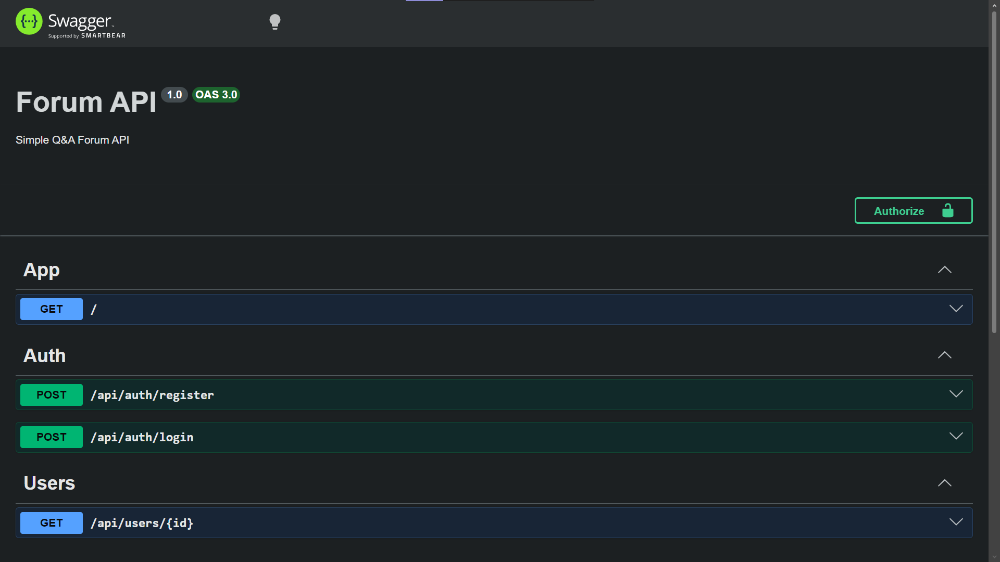
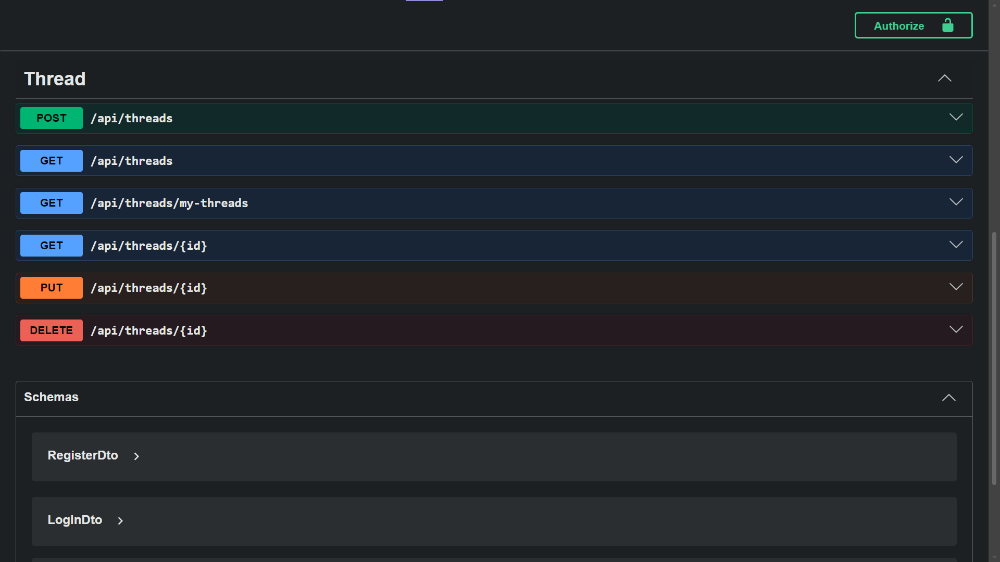

# Forum API

A backend REST API for a simple forum application built using **NestJS**, **Prisma**, and **SQLite**.
This project includes authentication, thread management, and user-based authorization.

---

## Tech Stack

* **Framework**: NestJS
* **Database ORM**: Prisma
* **Database**: SQLite (configurable)
* **Authentication**: JWT (JSON Web Token)
* **Validation**: class-validator & class-transformer

---

## Features

### Authentication

* Register user
* Login user (JWT-based)
* Password hashing with bcrypt

### Threads

* Create thread (authenticated)
* Get all threads (public)
* Get user’s threads (authenticated)
* Get thread by ID (public)
* Update thread (owner only)
* Delete thread (owner only)

### Authorization

* JWT Guard for protected routes
* Ownership validation (only creator can update/delete)

---

##  Project Structure

```
src/
 ├── auth/
 │    ├── dto/
 │    ├── auth.service.ts
 │    ├── jwt.guard.ts
 │    └── auth.controller.ts
 │
 ├── thread/
 │    ├── dto/
 │    ├── thread.service.ts
 │    └── thread.controller.ts
 │
 ├── prisma/
 │    ├── prisma.service.ts
 │    └── prisma.module.ts
 │
 ├── users/
 │    ├── users.service.ts
 │    └── users.controller.ts
 │
 └── main.ts
```

---

## Installation

```bash
git clone https://github.com/Cel44/Forum-api.git
cd Forum-api
npm install
```

---

## Environment Variables

Create a `.env` file:

```env
DATABASE_URL="file:./dev.db"
JWT_SECRET="your-secret-key"
```

---

## Database Setup

### 1. Generate Prisma Client

```bash
npx prisma generate
```

### 2. Run Migration

```bash
npx prisma migrate dev --name init
```

### 3. Seed Database

```bash
npx prisma db seed
```

---

## Run the Server

```bash
npm run start:dev
```

Server will run at:

```
http://localhost:3000
```

---

## API Documentation (Swagger)

Swagger UI is available at:

http://localhost:3000/api

### Auth Endpoints


### Thread Endpoints


---


## API Endpoints

### Auth

| Method | Endpoint             | Description       |
| ------ | -------------------- | ----------------- |
| POST   | `/api/auth/register` | Register new user |
| POST   | `/api/auth/login`    | Login and get JWT |

---

### Users

| Method | Endpoint         | Description            |
| ------ | ---------------- | ---------------------- |
| GET    | `/api/users/:id` | Get user profile by ID |

---

### Threads

| Method | Endpoint                  | Auth | Description                |
| ------ | ------------------------- | ---- | -------------------------- |
| POST   | `/api/threads`            | ✅    | Create thread              |
| GET    | `/api/threads`            | ❌    | Get all threads            |
| GET    | `/api/threads/my-threads` | ✅    | Get user's threads         |
| GET    | `/api/threads/:id`        | ❌    | Get thread by ID           |
| PUT    | `/api/threads/:id`        | ✅    | Update thread (owner only) |
| DELETE | `/api/threads/:id`        | ✅    | Delete thread (owner only) |

---

## Authentication Usage

Add header to protected routes:

```
Authorization: Bearer <your_token>
```

---

### Example login request:

```json
POST /api/auth/login

{
  "email": "johndoe@example.com",
  "password": "password123"
}
```

---

## Author

GitHub: https://github.com/Cel44

---

## License

This project is for learning purposes.
